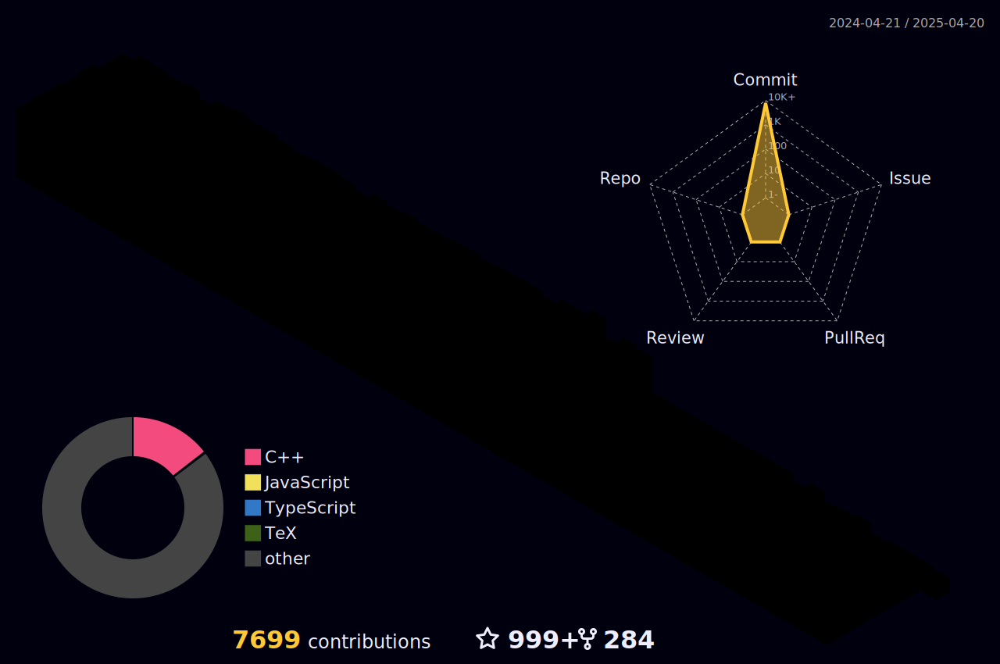

<h1 align="center">
  
  𝐇𝐞𝐥𝐥𝐨, &lt;𝚌𝚘𝚍𝚎𝚛𝚜/&gt;!
  
</h1>

<br/>
<br/>


- 🔭 𝙸’𝚖 𝚌𝚞𝚛𝚛𝚎𝚗𝚝𝚕𝚢 𝚠𝚘𝚛𝚔𝚒𝚗𝚐 𝚘𝚗 **Deep Learning 𝚊𝚗𝚍 Machine Learning.**
- 🌱 𝙸’𝚖 𝚌𝚞𝚛𝚛𝚎𝚗𝚝𝚕𝚢 𝚕𝚎𝚊𝚛𝚗𝚒𝚗𝚐 **Computer Vision 𝚊𝚗𝚍 Generative AI.**
- 👯 𝙸’𝚖 𝚕𝚘𝚘𝚔𝚒𝚗𝚐 𝚝𝚘 𝚌𝚘𝚕𝚕𝚊𝚋𝚘𝚛𝚊𝚝𝚎 𝚘𝚗 **𝙳𝚊𝚝𝚊 𝚂𝚌𝚒𝚎𝚗𝚌𝚎.**
- 💬 𝙰𝚜𝚔 𝙼𝚎 𝙰𝚋𝚘𝚞𝚝 𝙰𝚗𝚢𝚝𝚑𝚒𝚗𝚐 [here]() ! 𝙸 𝚊𝚖 𝚑𝚊𝚙𝚙𝚢 𝚝𝚘 𝚑𝚎𝚕𝚙.
- 😄 𝙿𝚛𝚘𝚗𝚘𝚞𝚗𝚜 : **𝙷𝚎/𝙷𝚒𝚖/𝙷𝚒𝚜.**
- ⚡ 𝙵𝚞𝚗 𝚏𝚊𝚌𝚝 : **𝙱𝚎𝚜𝚝 𝙿𝚊𝚛𝚝 𝙾𝚏 𝚃𝚑𝚎 𝙹𝚘𝚞𝚛𝚗𝚎𝚢 𝙸𝚜 : *𝙸𝚝 𝙴𝚗𝚍𝚜.***

<br/>
<br/>


<p align="center">
   •   
<!--   <a href="https://user-badge.committers.top/india_private/JayantGoel001"></a> • -->
   •
   •
</p>
<!-- <p align="center">
  <code>
    
  </code>
</p> -->

#


<p align="center">
  
  
  
</p>

#


<br/>

**𝙻𝙰𝙽𝙶𝚄𝙰𝙶𝙴𝚂 𝙰𝙽𝙳 𝚃𝙾𝙾𝙻𝚂:**  

<br/>
<br/>


<code></code>
<code></code>
<code></code>
<code></code>

#

<code></code>
<code></code>
<code></code>


<br/>

#

<details open="">
<summary>
  <g-emoji class="g-emoji" alias="chart_with_upwards_trend" fallback-src="https://github.githubassets.com/images/icons/emoji/unicode/1f4c8.png">📈</g-emoji>
  <strong>𝙶𝚒𝚝𝚑𝚞𝚋 𝚂𝚝𝚊𝚝𝚜 : </strong>
</summary>
<br/>

<p align="center">
    
    
</p>
</details>
<br/>


<!--  -->

<h4 align="center">
  
```diff
+@ @ @ @ @ @ @ @ @ @ @ @ @ @ @ @ @ @ @ @ @ @ @ @ @ @ @ @+
@@       o o                                           @@
@@       | |                                           @@
@@      _L_L_                                          @@
@@   ❮\/__-__\/❯ Programming isn't about what you know @@
@@   ❮(|~o.o~|)❯  It's about what you can figure out   @@
@@   ❮/ \`-'/ \❯                                       @@
@@     _/`U'\_                                         @@
@@    ( .   . )     .----------------------------.     @@
@@   / /     \ \    | while( ! (succeed=try() ) ) |     @@
@@   \ |  ,  | /    '----------------------------'     @@
@@    \|=====|/                                        @@
@@     |_.^._|                                         @@
@@     | |"| |                                         @@
@@     ( ) ( )   Testing leads to failure              @@
@@     |_| |_|   and failure leads to understanding    @@
@@ _.-' _j L_ '-._                                     @@
@@(___.'     '.___)                                    @@
+@ @ @ @ @ @ @ @ @ @ @ @ @ @ @ @ @ @ @ @ @ @ @ @ @ @ @ @+
```

</h4>  
  


<br/>

#

<!-- <summary>
  <g-emoji class="g-emoji" alias="chart_with_upwards_trend" fallback-src="https://github.githubassets.com/images/icons/emoji/unicode/1f4c8.png">📈</g-emoji>
  <strong>𝚆𝚊𝚔𝚊𝚃𝚒𝚖𝚎 𝚂𝚝𝚊𝚝𝚜 : </strong>
</summary>


<br>
<br>

<!--START_SECTION:waka-->
<!-- 


**🐱 My GitHub Data** 

> 📦 14.2 MB Used in GitHub's Storage 
 > 
> 🏆 949 Contributions in the Year 2025
 > 
> 💼 Opted to Hire
 > 
> 📜 207 Public Repositories 
 > 
> 🔑 2 Private Repositories  -->
 > 
<!-- **I'm a Night 🦉** 

```text
🌞 Morning                17314 commits       █████░░░░░░░░░░░░░░░░░░░░   18.18 % 
🌆 Daytime                26573 commits       ███████░░░░░░░░░░░░░░░░░░   27.90 % 
🌃 Evening                33145 commits       █████████░░░░░░░░░░░░░░░░   34.81 % 
🌙 Night                  18197 commits       █████░░░░░░░░░░░░░░░░░░░░   19.11 % 
```
📅 **I'm Most Productive on Sunday** 

```text
Monday                   13264 commits       ███░░░░░░░░░░░░░░░░░░░░░░   13.93 % 
Tuesday                  13350 commits       ████░░░░░░░░░░░░░░░░░░░░░   14.02 % 
Wednesday                13488 commits       ████░░░░░░░░░░░░░░░░░░░░░   14.16 % 
Thursday                 13280 commits       ███░░░░░░░░░░░░░░░░░░░░░░   13.95 % 
Friday                   13326 commits       ███░░░░░░░░░░░░░░░░░░░░░░   13.99 % 
Saturday                 13873 commits       ████░░░░░░░░░░░░░░░░░░░░░   14.57 % 
Sunday                   14648 commits       ████░░░░░░░░░░░░░░░░░░░░░   15.38 % 
``` -->


📊 **This Week I Spent My Time On** 

```text
🕑︎ Time Zone: EST/Detroit

💬 Programming Languages: 
<!-- Other                    14 hrs 34 mins      █████████████████████████   99.61 % 
Bash                     3 mins              ░░░░░░░░░░░░░░░░░░░░░░░░░   00.39 % 

🔥 Editors: 
Chrome                   14 hrs 38 mins      █████████████████████████   100.00 % 

🐱‍💻 Projects: 
rna-cdfq-yhh             14 hrs 38 mins      █████████████████████████   100.00 % 

💻 Operating System: 
Windows                  9 hrs 27 mins       ████████████████░░░░░░░░░   64.66 % 
Mac                      5 hrs 10 mins       █████████░░░░░░░░░░░░░░░░   35.34 %  -->
```

**I Mostly Code in Jupyter Notebook** 

```text
Pytorch                  10 repos            ███░░░░░░░░░░░░░░░░░░░░░░   13.70 % 
Python                    3 repos            ██░░░░░░░░░░░░░░░░░░░░░░░   08.22 % 
Dockerfile               2 repos             ░░░░░░░░░░░░░░░░░░░░░░░░░   01.37 % 
Tensorflow               1 repo              ░░░░░░░░░░░░░░░░░░░░░░░░░   00.68 % 
R                        1 repo              ░░░░░░░░░░░░░░░░░░░░░░░░░   00.68 % 
```


 Last Updated on 20/04/2025 02:48:12 UTC
<!--END_SECTION:waka-->
<!-- 
<p align="center">
  
  
</p>

#

<p align="center">
    
  <h4 align="center"><code>📊 𝙶𝚒𝚝𝙷𝚞𝚋 𝙼𝚎𝚝𝚛𝚒𝚌𝚜</code></h4>
</p>

<p align="center">
  
  
</p>

<h1>
  Connect With Me
  
</h1> -->

<!-- <p align="center">
  <br>
  <a href="https://www.linkedin.com/in/dinesh-kumar-raju/" target="_blank">
    <code></code>
  </a>
</p>
<br/>

<p align="center">
  <a href="https://www.hackerrank.com/JayantGoel001/" target="_blank">
    <code></code>
  </a>

  <a href="http://www.codeforces.com/profile/JayantGoel001" target="_blank">
    <code></code>
  </a>

  <a href="https://www.hackerearth.com/@jayantgoel001" target="_blank">
    <code></code>
  </a>

  <a href="https://www.codechef.com/users/jayantgoel001" target="_blank">
    <code></code>
  </a>
  
  <a href="https://leetcode.com/JayantGoel001/" target="_blank">
    <code></code>
  </a>
</p> -->

<br/>
<br/>

<div align="center">

### 𝚂𝚑𝚘𝚠 𝚜𝚘𝚖𝚎 ❤️ 𝚋𝚢 𝚜𝚝𝚊𝚛𝚛𝚒𝚗𝚐 𝚜𝚘𝚖𝚎 𝚘𝚏 𝚝𝚑𝚎 𝚛𝚎𝚙𝚘𝚜𝚒𝚝𝚘𝚛𝚒𝚎𝚜!

</div>

#


